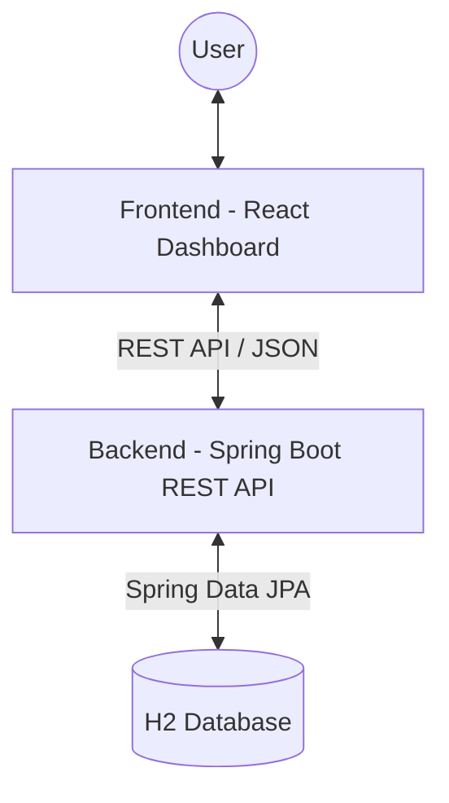

# 🏢 Resource Management System

[](https://spring.io/projects/spring-boot)
[](https://react.dev/)
[](https://www.oracle.com/java/)
[](https://opensource.org/licenses/MIT)

A robust, enterprise-ready full-stack application designed for managing organizational resources across Classrooms and Faculty offices. Built with a focus on ease of use, maintainability, and real-time synchronization.

---

## 📸 Overview

The **Resource Management System** provides a centralized dashboard to monitor, track, and manage physical resources (printers, projectors, computers, etc.). It bridges the gap between hardware tracking and administrative allocation.

### ✨ Key Features

- **🎯 Resource Tracking**: Real-time status Monitoring (`WORKING`, `NON_WORKING`).
- **📍 Smart Allocation**: Detailed allocation logic for `FACULTY` and `CLASSROOM` types.
- **🔍 Advanced Filtering**: Multi-parameter search by resource type, status, and name.
- **📊 Maintenance Logging**: Track maintenance cycles and purchase history.
- **🛡️ Production Ready**: CORS enabled, H2 persistent storage, and auto-seeding.

---

## 🏗️ System Architecture



### � Project Structure

```text
Lap/
├── README.md                           # Main Documentation
├── ResourceManagmentBackend/           # Java Spring Boot Service
│   └── src/
│       ├── main/java/com/aayush/...   # Business Logic & REST Controllers
│       └── main/resources/             # Configuration & DB Settings
└── Resource Management Dashboard/      # React Frontend
    └── src/
        ├── components/                 # UI Components (Radix UI)
        └── data/                       # Mock data & interfaces
```

---

## �️ Tech Stack

| Component | Technology | Role |
| :--- | :--- | :--- |
| **Frontend** | React, Vite | Reactive UI & Dev Workflow |
| **Styling** | Tailwind CSS | Modern Responsive Design |
| **State** | React Hooks | Component-level State |
| **API** | Spring Web | RESTful Endpoint Exposure |
| **Persistence**| Spring Data JPA | Object-Relational Mapping |
| **Database** | H2 (File-based) | High-speed Local Development |

---

## 🚦 Getting Started

### 📋 Prerequisites
- **Node.js** (v18+)
- **JDK 17** or higher
- **Maven** (optional, wrapper included)

### 🔧 Installation & Launch

#### 1. Backend Setup
```powershell
cd ResourceManagmentBackend
./mvnw.cmd spring-boot:run
```
> [!NOTE]
> On first run, the system will automatically seed the database with sample data defined in `DataLoader.java`.

#### 2. Frontend Setup
```powershell
cd "Resource Management Dashboard"
npm install
npm run dev
```
The application will launch at [http://localhost:5173](http://localhost:5173).

---

## 📖 API Reference

All API calls should be prefixed with `/api/resources`.

### Endpoints

| Method | Endpoint | Description |
| :--- | :--- | :--- |
| `GET` | `/` | Retrieve all resources (supports type/status/search filters) |
| `GET` | `/{id}` | Fetch specific resource details |
| `POST` | `/` | Register a new organizational resource |
| `PUT` | `/{id}` | Update existing resource metadata |
| `DELETE`| `/{id}` | Remove a resource from the system |

### Sample Payload (JSON)
```json
{
  "name": "EPSON L3250",
  "type": "PRINTER",
  "allocationType": "FACULTY",
  "status": "WORKING",
  "allocatedTo": "CS Department",
  "purchaseDate": "2024-02-23"
}
```

---

## 🤝 Contributing

1. Fork the Project
2. Create your Feature Branch (`git checkout -b feature/AmazingFeature`)
3. Commit your Changes (`git commit -m 'Add some AmazingFeature'`)
4. Push to the Branch (`git push origin feature/AmazingFeature`)
5. Open a Pull Request

## 📄 License

Distributed under the MIT License. See `LICENSE` for more information.

---

Designed with ❤️ for efficiency.
